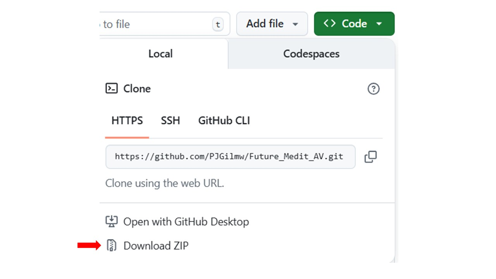
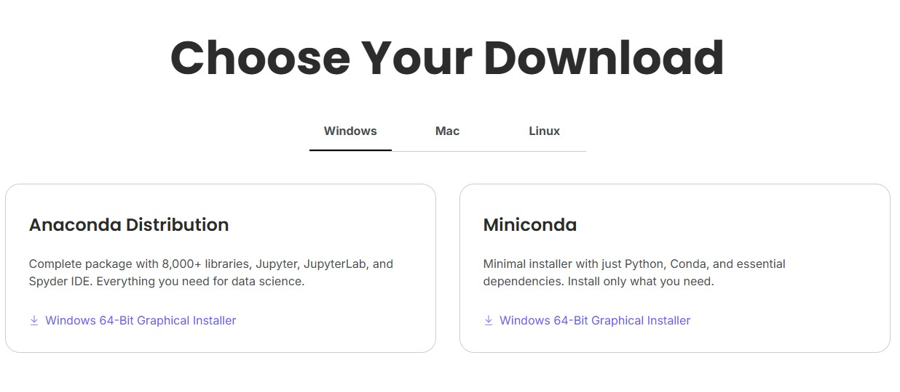

# Installing and running Brightway 2.5 from scratch

We explain the step-by-step procedure to run Brightway 2.5 from scratch on **Windows**, **macOS**, and **Linux**.
For each step, we explain in *italics* what is happening under the hood in lay terms — minimum mystery, maximum understanding.

Note that in computing there are often several ways to achieve the same result. Here, we propose **one safe and stable approach**.
This guide is written by non-IT users; terminology is intentionally simplified to maximize clarity for beginners.

**Expected time**: ~20 minutes
**Requirements**: Internet connection during installation; ecoinvent license if required

**Last time this worked**: 16/01/2026

---

## Step-by-step procedure

### 1. Download the files of this repository

Download the files of this repository by clicking on the upper-right corner of the page:



Unzip the file on your computer and keep the file structure intact in your own folder.

---

***What does it do / mean?***

*GitHub allows versioning your work (maintaining a consistent and traceable history of file changes), online backup via synchronization, and collaborative workflows. In this tutorial, we do not use these features. We simply download the files once and do not interact with GitHub afterward.*

---

### 2. Download and install Anaconda

Go to: [https://www.anaconda.com/download](https://www.anaconda.com/download)

* Click **Get Started** and sign in (or create an account)
* Choose your operating system, download and install.



You should now have access to an Anaconda terminal (**Anaconda Prompt** or **Anaconda PowerShell Prompt**).


***What does it do / mean?***

*Anaconda is an environment and package manager. It allows you to create isolated software environments (called conda environments), each with its own packages versions. This prevents conflicts between projects and ensures reproducibility.*

---

### 3. Create a conda environment for Brightway 2.5

Open your Anaconda terminal. You are now communicating with your system using shell commands (not Python yet).
By default, you are in the **base** environment — we will not install anything there.


Although Brightway can be installed directly using:

```
conda create -n bw25 -c conda-forge -c defaults -c cmutel brightway25
```

we instead provide a fixed environment file to ensure everyone installs **exactly the same package versions**.

Navigate to the `Environment_file` folder inside the downloaded repository:

```
cd <path_to_repository>/Environment_file
```

You can copy the path by right-clicking the folder and selecting *Copy path*.


Once inside the folder, create the environment:

```
conda env create --file env_bw_windows.yml
```

(Use the macOS or Linux file if applicable.)

This step may take several minutes.

---

### 4. Activate the environment

Check that the environment was created:

```
conda info --envs
```

Activate it:

```
conda activate lca_basics
```

You should see the environment name appear at the left of the command prompt.


To list installed packages:

```
conda list
```

IF you need to exit the environment:

```
conda deactivate
```

---

### 5. Set up a first Brightway project

Navigate to the Scripts folder
We go one step higher in the folder hierarchy with "..", and from there we enter Scripts.
```
cd ..
cd Scripts
```
Launch the setup script

```
jupyter setup_project.py
```

***What does it do / mean?***

*Python requires an interpreter to execute code. In this environment, we use Jupyter, which runs code in structured cells and is well suited for interactive workflows.*

Run the notebook cells

Follow the instructions in the notebook and execute each cell.
To execute a cell, use the Run button or press **Shift + Enter**.


---

You are now fully set up.

⚠️ Do not close the Anaconda terminal, as it will terminate the Jupyter session.
If you need another terminal while Jupyter is running, simply open a second Anaconda Prompt window.
